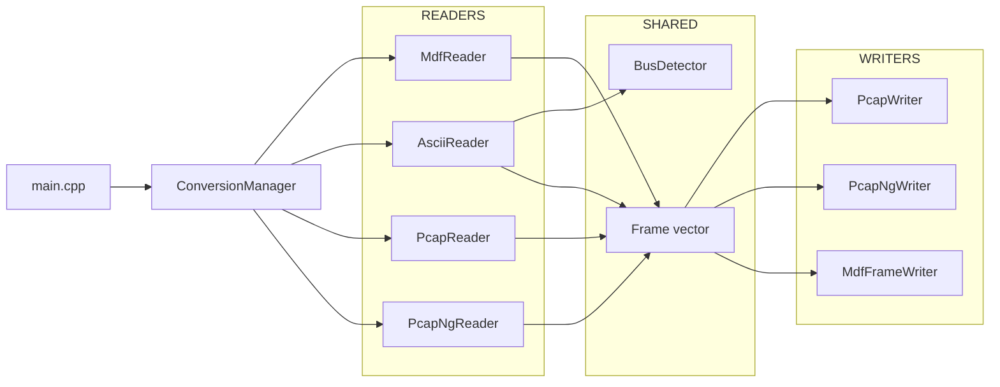

# Architecture globale – Convertisseur MDF/ASCII/PCAP/PCAPNG

## 1. Objectif du projet

Le projet fournit un exécutable C++ (`mdf2ascii`) capable de convertir des logs véhicules entre plusieurs formats :

- MDF4/MF4
- ASCII tabulé/CSV
- PCAP
- PCAPNG

Le cœur de design repose sur une structure interne unique (`Frame`) pour transporter les trames entre lecteurs et écrivains.

---

## 2. Matrice des conversions

| Conversion | Entrée | Sortie | Implémentation |
|---|---|---|---|
| MDF -> ASCII | `.mf4`, `.mdf` | `.asc` | `MdfReader::convertToAscii()` |
| MDF -> PCAP | `.mf4`, `.mdf` | `.pcap` | **Flux MDF→ASCII→PCAP** : `convertToAscii()` → `AsciiReader` + `BusDetector` → `PcapWriter` |
| MDF -> PCAPNG | `.mf4`, `.mdf` | `.pcapng` | **Flux MDF→ASCII→PCAP** : `convertToAscii()` → `AsciiReader` + `BusDetector` → `PcapNgWriter` |
| ASCII -> PCAP | `.asc`, `.csv` | `.pcap` | `AsciiReader` + `BusDetector` + `PcapWriter` |
| ASCII -> PCAPNG | `.asc`, `.csv` | `.pcapng` | `AsciiReader` + `BusDetector` + `PcapNgWriter` |
| PCAP -> MDF | `.pcap` | `.mf4` | `PcapReader` + `MdfFrameWriter` |
| PCAPNG -> MDF | `.pcapng` | `.mf4` | `PcapNgReader` + `MdfFrameWriter` (timestamps strictement croissants) |

---

## 3. Types de bus et périmètre

### 3.1 Types connus dans le code

Déclarés dans `bus/BusTypes.h` :

- `CAN`
- `CAN_FD`
- `LIN`
- `FlexRay`
- `Ethernet`
- `Unknown`

### 3.2 Ce qui est réellement converti selon le flux

- **MDF -> PCAP/PCAPNG** : flux **MDF→ASCII→PCAP** systématique. Groupes bus (CAN, LIN, FlexRay, Ethernet) convertis en `.asc`, puis lus par `AsciiReader` et écrits en PCAP/PCAPNG. En cas de trames mixtes, un fichier par type est créé (ex. `output_CAN.pcap`, `output_LIN.pcap`).
- **ASCII -> PCAP/PCAPNG** : CAN/CAN_FD/LIN/FlexRay/Ethernet (tous types convertibles via `isConvertibleToPcap()`)
- **PCAP/PCAPNG -> MDF** : CAN/CAN_FD/LIN/FlexRay/Ethernet

---

## 4. Arborescence de la solution

```
converter/
├── main.cpp
├── ConversionManager.h
├── ConversionManager.cpp
├── CMakeLists.txt
│
├── bus/
│   ├── BusTypes.h
│   ├── BusDetector.h
│   └── BusDetector.cpp
│
├── ascii/
│   ├── AsciiReader.h
│   └── AsciiReader.cpp
│
├── mdf/
│   ├── MdfReaderWrapper.h
│   ├── MdfReader.cpp
│   ├── MdfFrameWriter.h
│   └── MdfFrameWriter.cpp
│
├── pcap/
│   ├── PcapReader.h
│   ├── PcapReader.cpp
│   ├── PcapNgReader.h
│   ├── PcapNgReader.cpp
│   ├── PcapWriter.h
│   ├── PcapWriter.cpp
│   ├── PcapNgWriter.h
│   └── PcapNgWriter.cpp
│
└── deps/mdflib/
```

---

## 5. Architecture logique

**Diagrammes draw.io** (éditables avec [diagrams.net](https://app.diagrams.net/) ou l’extension VS Code) :

| Fichier | Description |
|---------|-------------|
| `docs/diagrams/architecture_connexions.drawio` | Architecture globale (CLI, ConversionManager, Readers, Writers) |
| `docs/diagrams/matrice_conversions.drawio` | Matrice des conversions entre formats |
| `docs/diagrams/flux_mdf_pcap.drawio` | Séquence MDF → PCAP/PCAPNG |
| `docs/diagrams/flux_pcap_mdf.drawio` | Séquence PCAP/PCAPNG → MDF |



**Note** : Pour MDF→PCAP/PCAPNG, le flux est **MDF→ASCII→PCAP** : `MR` crée des fichiers `.asc` via `convertToAscii()`, puis `AR` les lit et alimente `FR` pour l’écriture PCAP/PCAPNG.

---

## 6. Détail fichier par fichier

## `main.cpp`

### Rôle

- Parse les arguments CLI.
- Sélectionne le flux.
- Construit les chemins de sortie par défaut.
- Retourne un code de sortie `0/1`.

### Options gérées

- `--mdf2pcap`, `-m`
- `--mdf2pcapng`
- `--ascii2pcap`, `-a`
- `--ascii2pcapng`, `-n`
- `--pcap2mdf`, `-p`
- `--pcapng2mdf`
- sinon : mode MDF -> ASCII

### Points de design

- Le routage ne contient pas de logique métier : tout est délégué à `ConversionManager`.
- Les extensions de sortie sont auto-générées si non fournies (`.pcap`, `.pcapng`, `.mf4`, `.asc`).

---

## `ConversionManager.h/.cpp`

### Rôle

Couche d’orchestration : ouvre les lecteurs, récupère les `Frame`, ouvre les écrivains, et gère les messages utilisateur.

### Méthodes

- `mdfToAscii()`
- `mdfToPcap()`
- `mdfToPcapng()`
- `asciiToPcap()`
- `asciiToPcapng()`
- `pcapToMdf()`
- `pcapngToMdf()`

### Détails importants

- **MDF -> PCAP/PCAPNG** : utilise le flux **MDF→ASCII→PCAP** via `convertToAscii(baseStem, ascPaths)`. Seuls les fichiers bus (CAN, LIN, FlexRay, Ethernet) sont lus. Les fichiers ASCII intermédiaires sont supprimés automatiquement après conversion réussie. Si plusieurs types de bus, un fichier par type (ex. `output_CAN.pcap`, `output_LIN.pcap`).
- Pour ASCII -> PCAP/PCAPNG, l’écrivain est ouvert à la première trame valide (pour récupérer le bus initial).
- Pour PCAP/PCAPNG -> MDF : calcule `maxPayload` (8 pour CAN/LIN/FlexRay, jusqu’à 1518 pour Ethernet), groupe par type de bus, crée un fichier MDF par type avec le bon `BusType` et `maxPayload`.

---

## `bus/BusTypes.h`

### Rôle

Définit le modèle interne commun :

```cpp
struct Frame {
  BusType bus;
  double timestampSec;
  uint32_t id;
  uint8_t dlc;
  std::vector<uint8_t> data;
  // FlexRay : cycle (0-63), channel (0=A, 1=B), segment (Static/Dynamic)
  uint8_t flexRayCycleCount;
  uint8_t flexRayChannel;
  FlexRaySegment flexRaySegment;
};
```

### Pourquoi c’est important

- Découple les formats de fichier de la logique de conversion.
- Permet d’ajouter un nouveau format I/O sans toucher à tous les flux.

---

## `bus/BusDetector.h/.cpp`

### Rôle

Identifier si une ligne ASCII représente :

- une trame bus convertible, ou
- une mesure/signal non convertible.

### Mécanisme

1. Détection d’en-tête (`feedHeader`) :
   - colonnes `time/timestamp`, `id`, `dlc`, `data`
2. Détection type de bus à partir des noms de colonnes
3. Parsing ligne (`isBusFrame`) :
   - parse timestamp
   - parse ID (decimal/hex)
   - parse payload hex
   - vérifie cohérence DLC

### Types convertibles en PCAP

`isConvertibleToPcap()` renvoie `true` pour :

- `CAN`
- `CAN_FD`
- `LIN`
- `FlexRay`
- `Ethernet`

Tous les types de bus détectés dans les fichiers ASCII sont donc convertibles en PCAP/PCAPNG.

---

## `ascii/AsciiReader.h/.cpp`

### Rôle

Lire un ASCII ligne à ligne, transformer en `Frame` via `BusDetector`.

### Fonctionnement

- `open()` : ouvre le flux texte.
- `readFrame()` :
  - ignore les lignes vides
  - split par tabulation, sinon virgule
  - appelle `detector_.isBusFrame(...)`
  - retourne la prochaine trame convertible
- `close()` : libère le fichier.

---

## `mdf/MdfReaderWrapper.h` + `mdf/MdfReader.cpp`

### Rôle

Lecture MDF4 via `mdflib`, avec 2 modes :

- **export ASCII** (`convertToAscii`) : parcourt DG/CG, crée des fichiers `.asc` par groupe. Utilisé par le flux MDF→PCAP/PCAPNG.
- **extraction de trames en mémoire** (`extractFrames`) : alternative interne pour extraction directe (non utilisée par le flux principal MDF→PCAP)

### Choix de conception

- PIMPL (`void* mdfReader_`) pour éviter d’exposer `mdflib` dans le header.

### `open()`

- vérifie `mdf::IsMdfFile`
- crée `mdf::MdfReader`
- `ReadEverythingButData()`

### `convertToAscii(outputBasePath)` / `convertToAscii(outputBasePath, outPaths)`

- parcourt DG/CG
- crée des `ChannelObserver`
- charge les données `ReadData(*dg)`
- si groupe bus (CAN/LIN/FlexRay/Ethernet) : écrit format `Timestamp\tID\tDLC\tData` via `writeCanAscii()`
- sinon : écrit les signaux en colonnes tabulées
- surcharge avec `outPaths` : remplit le vecteur avec les chemins des fichiers bus créés (pour le flux MDF→PCAP)

### `extractFrames()`

- traite les channel groups bus : CAN (`CAN_DataFrame`, etc.), LIN (`LIN_DataFrame`), FlexRay (`FlexRay_DataFrame`), Ethernet (`Ethernet_DataFrame`)
- détecte le type de bus via `getBusTypeFromChannelGroup()` sur le nom du groupe
- lit les observateurs master/id/dlc/data (patterns génériques : `.ID`, `LIN_ID`, `MessageId`, `DataBytes`, `Data`, `Payload`, etc.)
- tronque les données au DLC réel (MDF padde à 8 octets, PCAP n’écrit que les octets utiles)
- pousse les `Frame` avec le bon `BusType` dans le vecteur de sortie
- pour Ethernet : payload jusqu’à 1518 octets

---

## `mdf/MdfFrameWriter.h/.cpp`

### Rôle

Écrire un `.mf4` à partir d’un `vector<Frame>`. Supporte **tous les types de bus** : CAN, LIN, FlexRay, Ethernet.

### Détail important

`mdflib::CreateBusLogConfiguration()` crée le **ChannelGroup adapté** selon le `BusType` passé à `open()` :
- CAN / CAN_FD → `CAN_DataFrame`
- LIN → `LIN_DataFrame`
- FlexRay → `FlexRay_DataFrame`
- Ethernet → `Ethernet_DataFrame`

Le format binaire (id/dlc/data) est identique pour tous ; `SaveCanMessage()` utilise le même conteneur `CanMessage` pour LIN, FlexRay et Ethernet (mdflib gère en interne).

### `open(filePath, busType, maxPayload)`

- crée `MdfWriterType::MdfBusLogger`
- `BusType(mdfBus)` selon le type (CAN, LIN, FlexRay, Ethernet)
- `StorageType(VlsdStorage)` — requis par asammdf pour la vue bus trace
- `MaxLength` borné entre 8 et 1518 (Ethernet jusqu’à 1518 octets)
- `CreateBusLogConfiguration()` — crée le CG approprié
- `SourceInformation` sur chaque CG (Type=Bus, Bus=Can/Lin/FlexRay/Ethernet) pour compatibilité asammdf

### `writeFrames()`

- sélectionne le CG selon `busType` (`cgNameForBus()`)
- calcule fenêtre temporelle start/stop
- `InitMeasurement()`, `StartMeasurement()`
- boucle trames : construit `mdf::CanMessage`, `SaveCanMessage(*dataFrameCg, ...)`
- `StopMeasurement()`, `FinalizeMeasurement()`

---

## `pcap/PcapReader.h/.cpp`

### Rôle

Décoder un fichier PCAP (`libpcap`) en `Frame`. Supporte les formats little-endian et big-endian.

### Pipeline

1. Lire global header (magic/version/network DLT). Détection automatique du byte order via les magic numbers (`0xa1b2c3d4`/`0xd4c3b2a1` microsecondes, `0xa1b23c4d`/`0x4d3cb2a1` nanosecondes).
2. Lire packet header (ts_sec, ts_usec, incl_len) avec byte-swap si big-endian
3. Décoder payload selon DLT

### DLT gérés

- `227` CAN SocketCAN
- `254` LIN
- `1` Ethernet
- `259` FlexRay (Frame Data type 0x01 ; Symbol ignorés ; cycle count, channel, segment extraits)

### Mapping vers `Frame`

- `timestampSec` depuis `(ts_sec, ts_usec)`
- `id` selon format bus
- `dlc` borné à `uint8_t`
- `data` payload utile

---

## `pcap/PcapNgReader.h/.cpp`

### Rôle

Décoder PCAPNG en `Frame`. Gère **plusieurs interfaces** (multi-bus dans un même fichier).

### Blocs gérés

- SHB (`0x0A0D0D0A`) — réinitialise la map interface→DLT à chaque nouvelle section
- IDB (`0x00000001`) — enregistre le DLT pour l’interface courante (`interfaceToDlt_[nextInterfaceId_++]`)
- EPB (`0x00000006`) — récupère `interface_id` et utilise le DLT correspondant pour parser la trame

### Mécanisme interne

- `readNextBlock()` lit les blocs en boucle
- `parseEpb(body, len, dlt)` reçoit le DLT de l’interface de l’EPB (via `interfaceToDlt_[interfaceId]`)
- `frameQueue_` sert de tampon interne

### DLT gérés

CAN (227), LIN (254), Ethernet (1), FlexRay (259) — mêmes mappings que `PcapReader`.

---

## `pcap/PcapWriter.h/.cpp`

### Rôle

Encoder des `Frame` vers PCAP.

### Étapes

1. `open()` écrit global header + DLT
2. `writeFrame()` :
   - convertit timestamp en `(sec, usec)`
   - construit payload selon bus
   - écrit packet header + payload
3. `close()`

### Encodage bus

- CAN : SocketCAN (8 bytes header + payload)
- LIN : header 5 bytes + payload
- Ethernet : trame brute
- FlexRay : header simplifié 7 bytes + payload

---

## `pcap/PcapNgWriter.h/.cpp`

### Rôle

Encoder des `Frame` vers PCAPNG.

### Étapes

- `open()` écrit SHB + IDB
- `writeFrame()` écrit un EPB par frame
- `close()`

### Détails techniques

- Timestamp écrit en nanosecondes (high/low 32 bits)
- padding EPB aligné sur 4 bytes
- DLT choisi selon bus

---

## `CMakeLists.txt`

### Rôle

- Configure C++17
- Intègre `deps/mdflib`
- Compile l’exécutable `mdf2ascii`
- Lie la lib `mdf`

### Sources incluses

- `main.cpp`
- `ConversionManager.cpp`
- dossiers `mdf/`, `ascii/`, `bus/`, `pcap/`

---

## 7. Séquences d’exécution

### 7.1 PCAP -> MDF

```text
main -> ConversionManager::pcapToMdf
  -> PcapReader::open
  -> PcapReader::extractFrames
  -> calc maxPayload
  -> MdfFrameWriter::open
  -> MdfFrameWriter::writeFrames
  -> .mf4 final
```

### 7.2 MDF -> PCAP / PCAPNG (flux MDF→ASCII→PCAP)

```text
main -> ConversionManager::mdfToPcap / mdfToPcapng
  -> MdfReader::open
  -> MdfReader::convertToAscii(baseStem, ascPaths)   # crée fichiers .asc par groupe bus
  -> pour chaque ascPath :
       AsciiReader::open(ascPath)
       while AsciiReader::readFrame(frame) -> allFrames.push_back
  -> tri par timestamp
  -> regroupement par type de bus
  -> PcapWriter / PcapNgWriter::open
  -> loop writeFrame
  -> suppression des fichiers .asc intermédiaires
  -> .pcap / .pcapng final
```

Le flux **MDF→ASCII→PCAP** est utilisé systématiquement (pas de fallback sur `extractFrames`). Les fichiers ASCII temporaires sont supprimés après écriture réussie.

---

## 8. Endianness, timestamps, unités

- `Frame.timestampSec` est en secondes flottantes.
- PCAP : timestamp `(sec, usec)`.
- PCAPNG : timestamp en nanosecondes (`uint64_t`).
- MDF writer : API alimentée en nanosecondes (`uint64_t`).

---

## 9. Gestion des erreurs

- Retour booléen sur toutes les opérations I/O.
- Messages explicites sur `std::cerr`.
- Conversion interrompue dès qu’un composant critique échoue (open/read/write/finalize).

---

## 10. Limites actuelles connues

Aucune limite critique. FlexRay : cycle count, channel (A/B), segment (Static/Dynamic dérivé du slot ID) sont extraits et conservés dans la structure `Frame`. Timestamps : en cas de doublons, incrément de 1 ms pour garantir la monotonie (requis par mdflib/asammdf).

---

## 11. Tests de non-régression

Des tests de non-régression par flux de conversion sont disponibles dans `tests/run_tests.cpp`. Ils vérifient la préservation du nombre de trames sur chaque flux :

- **MDF → PCAP** : conversion de référence
- **MDF → PCAPNG** : même nombre de trames que PCAP
- **PCAP → MDF** : round-trip complet
- **PCAPNG → MDF** : round-trip direct (timestamps forcés strictement croissants pour mdflib)
- **MDF → ASCII → PCAP** : flux complet

**Prérequis** : placer le fichier `00000012-64BB8F50.MF4` à la racine du projet (ou passer le chemin en argument).

**Exécution** :
```bash
cmake --build build --target run_tests
ctest --test-dir build -V -R conversion_regression
```

---

## 12. Axes d'évolution

1. Uniformiser la documentation fonctionnelle avec exemples de fichiers réels.
2. Couverture des cas limites et tests unitaires par module.

## 13. Résumé rapide

Le projet est structuré en trois couches :

- **Entrée CLI** (`main.cpp`)
- **Orchestration des flux** (`ConversionManager`)
- **Adaptateurs de formats** (lecteurs/écrivains MDF/ASCII/PCAP/PCAPNG)

La clé d’architecture est la structure `Frame`, qui sert d’interface interne commune et simplifie l’ajout de nouveaux formats ou nouveaux bus.
